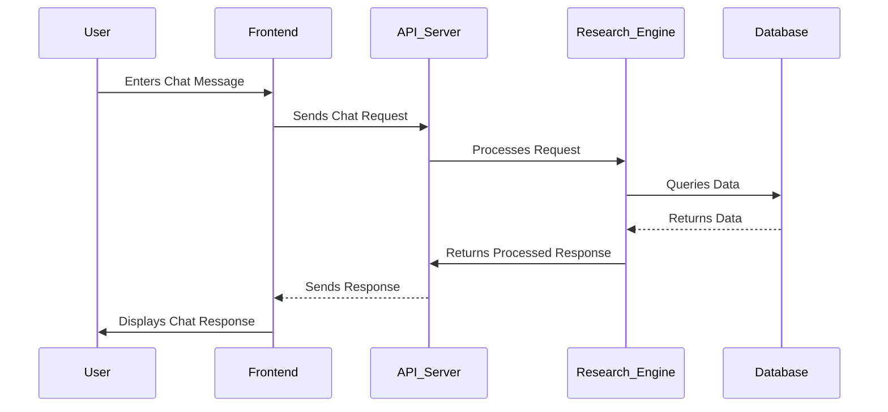

# Developer's Guide to Understanding and Contributing to Aurora

## Project Overview

### Purpose, Vision, and Core Functionality

Aurora is a cutting-edge chat application designed to facilitate in-depth research and analysis through AI-powered assistance. Its vision is to empower users to gain deeper insights from information overload by leveraging advanced natural language processing and machine learning techniques within a user-friendly chat interface.

The core functionality of Aurora revolves around:

*   **Chat Interface:** Providing a seamless and intuitive platform for users to interact with AI agents.
*   **Deep Research:** Enabling users to perform comprehensive research tasks by automatically gathering, analyzing, and summarizing information from various sources.
*   **Prompt Templating:** Allowing users to create and utilize pre-defined prompt templates to streamline their interactions with the AI.
*   **Filter and History:** Providing a comprehensive history of chats and applying filters on the data.

### Key Problems It Solves

Aurora addresses several key problems related to information access and analysis:

*   **Information Overload:** The abundance of information available online makes it difficult for users to find relevant and reliable sources. Aurora helps users filter and synthesize information efficiently.
*   **Time-Consuming Research:** Manual research processes can be time-consuming and require significant effort. Aurora automates research tasks, saving users time and effort.
*   **Lack of Expertise:** Users may lack the expertise to effectively analyze complex information. Aurora provides AI-powered assistance to guide users through the analysis process.
*   **Discovering Insights:** Aiding in discovery of non-obvious insights from the data.

### Primary User Base and Use Cases

The primary user base for Aurora includes:

*   **Researchers:** Academic and professional researchers who need to gather and analyze information from various sources.
*   **Analysts:** Business and financial analysts who need to extract insights from market data and industry reports.
*   **Journalists:** Investigative journalists who need to conduct in-depth research for their stories.
*   **Anyone seeking quick insights:** People who need to rapidly gain actionable knowledge about specific topics.

Use cases for Aurora include:

*   **Market Research:** Analyzing market trends and identifying potential opportunities.
*   **Competitive Analysis:** Evaluating the strengths and weaknesses of competitors.
*   **Scientific Research:** Gathering and analyzing scientific literature.
*   **Financial Analysis:** Evaluating investment opportunities.
*   **Content Creation:** Assisting writers and content creators in generating high-quality content.
*   **Education:** Providing students with a powerful tool for research and learning.

### Tech Stack Overview

Aurora is built on a modern tech stack that emphasizes performance, scalability, and maintainability:

*   **Frontend:**
    *   **React:** A popular JavaScript library for building user interfaces.
    *   **TypeScript:** A superset of JavaScript that adds static typing for improved code quality.
    *   **Vite:** A fast and lightweight build tool for modern web development.
    *   **Redux Toolkit:** A set of tools that simplify Redux development.
    *   **Tailwind CSS:** A utility-first CSS framework for rapid UI development.
    *   **Shadcn UI:** A collection of accessible and reusable UI components built with React and Radix UI.
    *   **React Hook Form:** For form state management and validation.
    *   **Zod:** For schema validation.
*   **Backend:** (Not explicitly defined in provided files, but implied through API calls)
    *   **Node.js/Python:** Assumed backend language for the API.
    *   **Express/Flask/FastAPI:** Assumed backend framework.
    *   **Vector Database/RAG pipeline:** Assumed to be in use given deep research features.
*   **Infrastructure:**
    *   **Docker:** A platform for building and running applications in containers.
    *   **Docker Compose:** A tool for defining and managing multi-container Docker applications.
    *   **Nginx:** A high-performance web server and reverse proxy.

## System Architecture

### Core Architecture Diagram

```mermaid
graph LR
    subgraph Frontend
        A[User Interface (React/Vite)]
        B[Redux Store]
        C[UI Components (Shadcn UI, Tailwind CSS)]
        D[API Services (RTK Query)]
        E[Routing (React Router)]
    end

    subgraph Backend
        F[API Server (Node.js/Python)]
        G[Data Processing & Research Engine]
        H[Database (Vector Database)]
    end

    A --> E --> D -.-> F
    F --> G
    G --> H
    D --> B
    A --> C
    B --> C
    style A fill:#f9f,stroke:#333,stroke-width:2px
    style B fill:#ccf,stroke:#333,stroke-width:2px
    style F fill:#f9f,stroke:#333,stroke-width:2px
    style H fill:#ccf,stroke:#333,stroke-width:2px
```

### Explanation of the Architecture Diagram

The architecture of Aurora is divided into two main parts: Frontend and Backend.

1.  **User Interface (React/Vite):** This is where the user interacts with the application. Built using React and bundled with Vite, it provides a fast and reactive user experience.
2.  **Redux Store:** This component manages the application's state. It holds the chat messages, side panel state, and any other data needed by multiple components.
3.  **UI Components (Shadcn UI, Tailwind CSS):** This includes all the UI components, which are built using Shadcn UI and styled with Tailwind CSS.
4.  **API Services (RTK Query):** RTK Query simplifies data fetching and caching, managing communication with the backend API.
5.  **Routing (React Router):** React Router handles navigation between different parts of the application, such as the chat interface, API key settings, and error pages.
6.  **API Server (Node.js/Python):** The API server is the entry point for all backend requests. It handles authentication, request routing, and data processing.
7.  **Data Processing & Research Engine:** This component is responsible for processing data and performing research tasks. It could involve natural language processing, machine learning, and data analysis.
8.  **Database (Vector Database):** The database stores all the application's data, including chat messages, user data, and research results.

### Data Flow Diagram



### Explanation of the Data Flow Diagram

This diagram illustrates the sequence of actions and data flow involved in a typical chat interaction within Aurora:

1.  **User Enters Chat Message:** The user initiates a chat interaction by entering a message in the UI.
2.  **Frontend Sends Chat Request:** The frontend application captures the user's message and sends it to the backend API server.
3.  **API Server Processes Request:** The API server receives the chat request and routes it to the appropriate handler in the Research Engine.
4.  **Research Engine Queries Data:** The Research Engine determines the necessary data to process the request and queries the database.
5.  **Database Returns Data:** The database retrieves the requested data and returns it to the Research Engine.
6.  **Research Engine Returns Processed Response:** The Research Engine processes the data, generating a response, and returns it to the API server.
7.  **API Server Sends Response:** The API server receives the processed response from the Research Engine and sends it back to the frontend.
8.  **Frontend Displays Chat Response:** The frontend application receives the response from the API server and displays it to the user in the chat interface.

## Development Environment Setup

### Prerequisites and Tools Installation

Before you can start contributing to Aurora, you need to install the following prerequisites:

*   **Node.js:** JavaScript runtime environment.
    *   Install from: [https://nodejs.org/](https://nodejs.org/)
    *   ✅ Verified: `node -v` should output the installed version.
*   **pnpm:** A fast, disk space efficient package manager.
    *   Install from: [https://pnpm.io/](https://pnpm.io/)
    *   ✅ Verified: `pnpm -v` should output the installed version.
*   **Docker:** A platform for building and running applications in containers.
    *   Install from: [https://www.docker.com/](https://www.docker.com/)
    *   ✅ Verified: `docker -v` should output the installed version.
*   **Docker Compose:** A tool for defining and managing multi-container Docker applications.
    *   Install from: [https://docs.docker.com/compose/install/](https://docs.docker.com/compose/install/)
    *   ✅ Verified: `docker-compose -v` should output the installed version.

### Step-by-Step Configuration Instructions

1.  **Clone the repository:**

    ```bash
    git clone <repository_url>
    cd <repository_directory>
    ```

2.  **Install dependencies:**

    ```bash
    pnpm install
    ```

3.  **Set up environment variables:**
    *   Create a `.env` file in the root directory.
    *   Add the necessary environment variables (see [Environment Variables and Configuration Files Explanation](#environment-variables-and-configuration-files-explanation) below).

4.  **Start the development server:**

    ```bash
    pnpm run dev
    ```

### Environment Variables and Configuration Files Explanation

Aurora uses the following environment variables:

*   `API_URL`: The URL of the backend API server. Defined within `src/services/api/customFetchBase.ts`.
    ```typescript
    const baseQuery = fetchBaseQuery({
      baseUrl: import.meta.env.API_URL, // API_URL is used here
      // prepareHeaders: async (headers, { getState }) => { // Authentication commented out
      //   const token = (getState() as RootState).auth.token
      //   if (token) {
      //     headers.set('authorization', `Bearer ${token}`)
      //   }
      //   return headers
      // },
    })
    ```

The following configuration files are used:

*   `package.json`: Defines the project's dependencies and scripts.
*   `vite.config.ts`: Configures the Vite build tool, defining environment variables and aliases.
*   `tailwind.config.js`: Configures the Tailwind CSS framework, defining the theme and content paths.
*   `components.json`: Configures the Shadcn UI component library, defining styling preferences and aliases.
*   `tsconfig.json`, `tsconfig.app.json`, `tsconfig.node.json`: TypeScript compiler options.
*   `eslint.config.js`: ESLint configuration for code linting.
*   `postcss.config.js`: PostCSS configuration for Tailwind CSS and Autoprefixer.
*   `docker-compose.yml`: Defines the multi-container application's structure for Docker.
*   `nginx.conf`: Configures the Nginx web server.

### Verification Steps to Ensure Everything is Working Correctly

1.  **Development server:**
    *   Open your browser and navigate to `http://localhost:5173` (or the port Vite uses).
    *   You should see the Aurora application running.
2.  **API connection:**
    *   Open the browser's developer console and check for any network errors.
    *   Verify that the frontend is able to communicate with the backend API by sending a chat message and receiving a response.
3.  **Docker:**
    *   Run `docker-compose up` in the project root directory.
    *   Open your browser and navigate to `http://localhost:3000`.
    *   You should see the Aurora application running within the Docker container.

### Common Setup Issues and Their Solutions

*   **Missing dependencies:** If you encounter errors related to missing dependencies, make sure you have run `pnpm install` to install all the required packages.
*   **Environment variables not loaded:** If the application is not able to access the environment variables, make sure you have created a `.env` file in the root directory and that the variables are correctly defined. Also, restart the development server after creating or modifying the `.env` file.
*   **Port conflicts:** If the development server or Docker container is not able to start because of a port conflict, try changing the port number in the `vite.config.ts` or `docker-compose.yml` file.
*   **Docker errors:** If you encounter errors related to Docker, make sure Docker is installed and running on your system. Also, check the Docker logs for any error messages.

## Codebase Walkthrough

### Directory Structure Overview

The Aurora codebase is organized into the following directories:

```
├── Dockerfile
├── components.json
├── README.md
├── package.json
├── docker-compose.yml
├── index.html
├── postcss.config.js
├── vite.config.ts
├── tailwind.config.js
├── nginx.conf
└── src
    ├── main.tsx
    ├── App.tsx
    ├── index.css
    ├── vite-env.d.ts
    ├── libs
    │   └── utils.ts
    │   └── redux
    │       ├── chatMessagesSlice.ts
    │       ├── sidePanelSlice.ts
    │       ├── store.ts
    │       └── hooks.ts
    ├── pages
    │   ├── ChatStudioPage.tsx
    │   ├── ApiKeyPage.tsx
    │   └── NotFoundPage.tsx
    ├── hooks
    │   ├── useStreamingResponse.ts
    │   └── useClickOutside.tsx
    ├── types
    │   ├── common.ts
    │   ├── prompt-template.ts
    │   └── deep-research.ts
    ├── router
    │   ├── routes.tsx
    │   ├── ProtectedRoute.tsx
    │   └── index.tsx
    ├── services
    │   ├── chatApi.ts
    │   ├── promptTemplateApi.ts
    │   └── filters
    │       └── filtersApi.ts
    │   └── api
    │       ├── apiSlice.ts
    │       └── customFetchBase.ts
    ├── utils
    │   ├── helpers.tsx
    │   ├── data.ts
    │   ├── parser.ts
    │   └── index.ts
    ├── components
    │   ├── hook-form
    │   │   └── HookFormItem.tsx
    │   ├── shared
    │   │   ├── TypingLoadder.tsx
    │   │   ├── TextSelectionWrapper.tsx
    │   │   └── MarkdownContent.tsx
    │   ├── spinner
    │   │   └── index.tsx
    │   └── ui
    │       ├── autosize-textarea.tsx
    │       ├── accordion.tsx
    │       ├── dialog.tsx
    │       ├── card.tsx
    │       ├── form.tsx
    │       ├── popover.tsx
    │       ├── select.tsx
    │       ├── table.tsx
    │       ├── textarea.tsx
    │       ├── label.tsx
    │       ├── separator.tsx
    │       ├── button.tsx
    │       ├── scroll-area.tsx
    │       ├── calendar.tsx
    │       └── input.tsx
    │   └── select
    │       ├── SimpleSelect.tsx
    │       └── MultiSelect.tsx
    ├── validators
    │   ├── authSchema.ts
    │   └── filtersSchema.ts
    └── features
        └── chat-studio
            └── chat
                ├── ChatInterface.tsx
                ├── ChatMessage.tsx
                └── components
                    └── AiResponseAction.tsx
                └── custom-message
                    ├── DeepResearchMessage.tsx
                    └── components
                        ├── FinalAnswerSection.tsx
                        └── ResearchContent.tsx
                └── prompt-template
                    └── PromptTemplateModal.tsx
            └── history
                └── ChatHistory.tsx
            └── filters
                ├── TableView.tsx
                └── FilterConfigController.tsx
```

### Entry Points to the Application

*   `index.html`: The main HTML file that serves as the entry point for the application.
*   `src/main.tsx`: The main JavaScript file that renders the React application.
*   `src/App.tsx`: The root component of the React application, responsible for rendering the main layout and initializing the routing system.

### Core Modules and Their Responsibilities

*   `src/libs/redux`: Contains Redux-related files, including:
    *   `store.ts`: Configures the Redux store.
    *   `chatMessagesSlice.ts`: Manages the state of chat messages.
    *   `sidePanelSlice.ts`: Manages the state of the side panels.
    *   `hooks.ts`: Provides custom React-Redux hooks for type-safe state management.
*   `src/pages`: Contains the main pages of the application, including:
    *   `ChatStudioPage.tsx`: Renders the main UI for the Chat Studio application.
    *   `ApiKeyPage.tsx`: Handles API key input and validation.
    *   `NotFoundPage.tsx`: Renders a custom "404 Not Found" page.
*   `src/router`: Contains the routing configuration for the application, including:
    *   `routes.tsx`: Defines the application's routes.
    *   `ProtectedRoute.tsx`: Controls access to protected parts of the application.
    *   `index.tsx`: Creates the browser router and renders the `RouterProvider`.
*   `src/services`: Contains API-related files, including:
    *   `chatApi.ts`: Defines API endpoints for interacting with the chat service.
    *   `promptTemplateApi.ts`: Defines an API slice for retrieving prompt templates.
    *   `api/apiSlice.ts`: Sets up the foundation for making API requests using Redux Toolkit Query.
    *   `api/customFetchBase.ts`: Provides a custom base query function for making API requests.
    *   `filters/filtersApi.ts`: Defines API endpoints for retrieving filter options.
*   `src/components`: Contains reusable UI components, including:
    *   `ui`: Contains basic UI components styled with Tailwind CSS and Radix UI.
    *   `shared`: Contains components used across multiple parts of the application.
    *   `select`: Contains custom select components.
    *   `hook-form`: Contains components for integrating with React Hook Form.
*   `src/features`: Contains feature-specific code, such as:
    *   `chat-studio`: Contains code related to the Chat Studio feature, including chat interface, history, and filters.
*   `src/types`: Contains TypeScript type definitions.
*   `src/utils`: Contains utility functions and data.
*   `src/validators`: Contains schemas for validating data.

### Important Design Patterns and Architectural Decisions

*   **Redux for State Management:** Aurora uses Redux to manage the application's state, providing a centralized and predictable way to handle data.
*   **RTK Query for Data Fetching:** RTK Query simplifies data fetching and caching, making it easier to interact with the backend API.
*   **Tailwind CSS for Styling:** Tailwind CSS provides a utility-first approach to styling, allowing for rapid UI development.
*   **Shadcn UI for UI Components:** Shadcn UI provides a collection of accessible and reusable UI components, ensuring a consistent look and feel across the application.
*   **React Hook Form for Form Management:** React Hook Form simplifies form management and validation, making it easier to create complex forms.
*   **Zod for Schema Validation:** Zod provides a schema validation library for ensuring data integrity.
*   **Feature-Based Organization:** The codebase is organized into features, making it easier to manage and scale the application.

### Directory Structure Rationale

The directory structure is designed to promote code organization, maintainability, and scalability. Key rationales include:

*   **Separation of Concerns:** Each directory is responsible for a specific aspect of the application, such as UI components, API services, or state management.
*   **Modularity:** The feature-based organization allows for easy addition and removal of features without affecting other parts of the application.
*   **Reusability:** Reusable components and utility functions are placed in shared directories, making them easily accessible across the application.
*   **Testability:** The clear separation of concerns makes it easier to write unit tests and integration tests for each module.

### Practical Exercise: Trace a Request Through the System

Let's trace a request when a user sends a message in the Chat Studio:

1.  **User Input:** The user types a message into the input field within the `ChatInterface.tsx` component (`src/features/chat-studio/chat/ChatInterface.tsx`).
2.  **Message Submission:** When the user submits the message, the `ChatInterface.tsx` component calls the `useStreamResponseForChat` hook (`src/hooks/useStreamingResponse.ts`).
3.  **API Request:** The `useStreamResponseForChat` hook triggers an API request to the backend using either `useAddQueryMutation` or `useAddSteamingQueryMutation` from `chatApi.ts` (`src/services/chatApi.ts`), depending on if deep research is enabled. The endpoint will be either `/chat/` or `/chat/stream` (or `/chat/deep_think/stream` for deep research).  The `apiSlice.ts` (`src/services/api/apiSlice.ts`) and `customFetchBase.ts` (`src/services/api/customFetchBase.ts`) files handle the underlying API communication, including setting the base URL and any necessary headers.
4.  **Backend Processing:** The backend API server receives the request and processes the message. If deep research is enabled, it may involve several steps, like rewriting, thinking, and researching, before returning the final answer.
5.  **Response Streaming:** If `useAddSteamingQueryMutation` is used, the backend sends a streamed response back to the frontend. The `useStreamResponseForChat` hook receives the streamed data incrementally.
6.  **State Update:** As the data streams in, the `useStreamResponseForChat` hook updates the chat message state using Redux. The `chatMessagesSlice.ts` (`src/libs/redux/chatMessagesSlice.ts`) manages this state, adding new messages or updating existing ones in the Redux store.
7.  **UI Update:** The `ChatInterface.tsx` component is connected to the Redux store using `useAppSelector` from `hooks.ts` (`src/libs/redux/hooks.ts`). As the state changes, the component re-renders, displaying the new or updated chat message.

## Key Technical Concepts

### Redux for State Management

*   **Concept:** Redux is a predictable state container for JavaScript apps. It helps you write applications that behave consistently, run in different environments (client, server, and native), and are easy to test.
*   **Code Example:**

    ```typescript
    // src/libs/redux/chatMessagesSlice.ts
    import { createSlice, PayloadAction } from '@reduxjs/toolkit';
    import { ChatMessageType } from '@/types/common';

    interface ChatState {
      messages: ChatMessageType[];
      filterIds: string[];
    }

    const initialState: ChatState = {
      messages: [],
      filterIds: [],
    };

    export const chatMessagesSlice = createSlice({
      name: 'chatMessages',
      initialState,
      reducers: {
        addMessage: (state, action: PayloadAction<ChatMessageType>) => {
          state.messages.push(action.payload);
        },
        // ... other reducers
      },
    });

    export const { addMessage } = chatMessagesSlice.actions;
    export default chatMessagesSlice.reducer;
    ```

*   **Problem Solved:** Manages the chat message state, allowing different components to access and update the chat messages.
*   🔑 **Key Insight:** Redux provides a centralized and predictable way to manage the application's state, making it easier to reason about and debug.
*   ⚠️ **Common Pitfall:** Overusing Redux for local component state can lead to unnecessary complexity. Use local state for component-specific data.

### RTK Query for Data Fetching

*   **Concept:** RTK Query is a powerful data fetching and caching tool built on top of Redux Toolkit. It simplifies data fetching, caching, and updating, reducing boilerplate code.
*   **Code Example:**

    ```typescript
    // src/services/chatApi.ts
    import { apiSlice } from './api/apiSlice';

    export const chatApi = apiSlice.injectEndpoints({
      endpoints: (builder) => ({
        addQuery: builder.mutation({
          query: (data) => ({
            url: '/chat/',
            method: 'POST',
            body: data,
          }),
        }),
      }),
    });

    export const { useAddQueryMutation } = chatApi;
    ```

*   **Problem Solved:** Simplifies data fetching and caching, reducing boilerplate code and improving performance.
*   🔑 **Key Insight:** RTK Query automatically handles caching, retries, and error handling, making it easier to build robust data-driven applications.
*   ⚠️ **Common Pitfall:** Not understanding RTK Query's caching strategies can lead to unexpected behavior. Pay attention to `providesTags` and `invalidatesTags`.

### Tailwind CSS for Styling

*   **Concept:** Tailwind CSS is a utility-first CSS framework that provides a set of pre-defined CSS classes for styling HTML elements.
*   **Code Example:**

    ```tsx
    // src/components/ui/button.tsx
    import { cva, type VariantProps } from 'class-variance-authority'
    import { cn } from "@/libs/utils"

    const buttonVariants = cva(
      "inline-flex items-center justify-center whitespace-nowrap rounded-md text-sm font-medium transition-colors focus-visible:outline-none focus-visible:ring-1 focus-visible:ring-ring disabled:pointer-events-none disabled:opacity-50",
      {
        variants: {
          variant: {
            default: "bg-primary text-primary-foreground shadow hover:bg-primary/90",
            destructive: "bg-destructive text-destructive-foreground shadow-sm hover:bg-destructive/90",
            outline: "bg-background border border-input text-foreground shadow-sm hover:bg-accent hover:text-accent-foreground",
            secondary: "bg-secondary text-secondary-foreground shadow-sm hover:bg-secondary/80",
            ghost: "hover:bg-accent hover:text-accent-foreground",
            link: "text-primary underline-offset-4 hover:underline",
          },
          size: {
            default: "h-9 px-4",
            sm: "h-8 rounded-md px-3 text-xs",
            lg: "h-10 rounded-md px-8",
            icon: "h-9 w-9",
          },
        },
        defaultVariants: {
          variant: "default",
          size: "default",
        },
      }
    )

    export interface ButtonProps
      extends React.ButtonHTMLAttributes<HTMLButtonElement>, VariantProps<typeof buttonVariants> {}
    ```

*   **Problem Solved:** Allows for rapid UI development by providing a set of pre-defined CSS classes that can be easily combined to create custom styles.
*   🔑 **Key Insight:** Tailwind CSS promotes consistency and maintainability by enforcing a design system.
*   ⚠️ **Common Pitfall:** Overriding Tailwind CSS classes with custom CSS can lead to inconsistencies and make it harder to maintain the codebase.

### React Hook Form and Zod for Form Validation

*   **Concept:** React Hook Form is a library for building performant, flexible and extensible forms with easy-to-use validation. Zod is a TypeScript-first schema declaration and validation library.
*   **Code Example:**

    ```typescript
    // src/pages/ApiKeyPage.tsx
    import { zodResolver } from "@hookform/resolvers/zod"
    import { useForm } from "react-hook-form"
    import * as z from "zod"

    import { Button } from "@/components/ui/button"
    import {
      Form,
      FormControl,
      FormField,
      FormItem,
      FormLabel,
      FormMessage,
    } from "@/components/ui/form"
    import { Input } from "@/components/ui/input"

    const apiKeySchema = z.object({
      apiKey: z.string().min(10, {
        message: "API Key must be at least 10 characters.",
      }),
    })

    type ApiKeyType = z.infer<typeof apiKeySchema>

    export function ApiKeyPage() {
      const form = useForm<ApiKeyType>({
        resolver: zodResolver(apiKeySchema),
        defaultValues: {
          apiKey: "",
        },
      })

      function onSubmit(values: ApiKeyType) {
        // Do something with the form values.
        // ✅ This will be type-safe and validated.
        console.log(values)
      }

      return (
        <Form {...form}>
          <form onSubmit={form.handleSubmit(onSubmit)} className="space-y-4">
            <FormField
              control={form.control}
              name="apiKey"
              render={({ field }) => (
                <FormItem>
                  <FormLabel>API Key</FormLabel>
                  <FormControl>
                    <Input placeholder="sk-" {...field} />
                  </FormControl>
                  <FormMessage />
                </FormItem>
              )}
            />
            <Button type="submit">Submit</Button>
          </form>
        </Form>
      )
    }
    ```

*   **Problem Solved:** Simplifies form management, validation, and error handling, improving the user experience.
*   🔑 **Key Insight:** React Hook Form integrates well with Zod, providing a type-safe and efficient way to validate form data.
*   ⚠️ **Common Pitfall:** Forgetting to handle form errors gracefully can lead to a poor user experience.

## Workflow Guide

### How to Implement a New Feature

Let's say you want to add a new feature to Aurora: **Prompt Categories**. This feature will allow users to categorize prompt templates for better organization.

1.  **Create a new branch:**

    ```bash
    git checkout -b feature/prompt-categories
    ```

2.  **Implement the feature:**
    *   **Backend:**
        *   Update the `PromptTemplate` type (`src/types/prompt-template.ts`) to include a `category` field.
        *   Modify the `promptTemplateApi` (`src/services/promptTemplateApi.ts`) to include a new endpoint for creating, updating, and retrieving prompt categories.
        *   Update the backend API to handle the new category field.
    *   **Frontend:**
        *   Create a new component for managing prompt categories.
        *   Update the `PromptTemplateModal.tsx` component (`src/features/chat-studio/chat/prompt-template/PromptTemplateModal.tsx`) to display prompt templates by category.
        *   Add UI elements for filtering and sorting prompt templates by category.
3.  **Add tests:**
    *   Write unit tests for the new components and API endpoints.
    *   Write integration tests to verify that the feature works correctly.
4.  **Commit your changes:**

    ```bash
    git add .
    git commit -m "feat: add prompt categories feature"
    ```

5.  **Create a pull request:**
    *   Push your branch to the remote repository.
    *   Create a pull request from your branch to the `main` branch.
6.  **Code review:**
    *   Wait for the code review.
    *   Address any feedback from the reviewers.
7.  **Merge the pull request:**
    *   Once the code review is complete, merge the pull request into the `main` branch.

### How to Fix a Bug

Let's say you found a bug in Aurora: **Chat messages are not displayed in the correct order**.

1.  **Create a new branch:**

    ```bash
    git checkout -b fix/chat-message-order
    ```

2.  **Identify the root cause:**
    *   Use the browser's developer tools to inspect the chat messages in the Redux store.
    *   Verify that the messages are being added to the store in the correct order.
    *   Check the `chatMessagesSlice.ts` (`src/libs/redux/chatMessagesSlice.ts`) file to see how the messages are being added to the store.
3.  **Fix the bug:**
    *   Modify the `chatMessagesSlice.ts` file to ensure that the messages are added to the store in the correct order.
4.  **Add tests:**
    *   Write a unit test to verify that the chat messages are displayed in the correct order.
5.  **Commit your changes:**

    ```bash
    git add .
    git commit -m "fix: chat message order"
    ```

6.  **Create a pull request:**
    *   Push your branch to the remote repository.
    *   Create a pull request from your branch to the `main` branch.
7.  **Code review:**
    *   Wait for the code review.
    *   Address any feedback from the reviewers.
8.  **Merge the pull request:**
    *   Once the code review is complete, merge the pull request into the `main` branch.

### How to Add Tests for New Functionality

When adding new functionality to Aurora, it's important to add tests to ensure that the new code works correctly and doesn't introduce any bugs.

*   **Unit Tests:** Unit tests verify that individual functions or components work as expected.
*   **Integration Tests:** Integration tests verify that different parts of the application work together correctly.
*   **End-to-End Tests:** End-to-end tests verify that the entire application works correctly from the user's perspective.

### Code Review Process and Standards

The code review process is an important part of the development workflow in Aurora. It helps to ensure that the code is of high quality and meets the project's standards.

*   **Code Reviewers:** Experienced developers are responsible for reviewing the code.
*   **Code Review Checklist:**
    *   The code is well-documented.
    *   The code is easy to read and understand.
    *   The code is efficient and performs well.
    *   The code is secure and doesn't introduce any security vulnerabilities.
    *   The code meets the project's standards.
*   **Code Review Feedback:** Reviewers provide feedback on the code, highlighting any areas that need improvement.
*   **Code Review Approval:** Once the code review is complete and all feedback has been addressed, the code is approved and can be merged into the `main` branch.

### Practical Exercise: Implement a Simple Feature

Let's implement a simple feature: **Add a "Clear Chat" button to the ChatInterface**.

1.  **Create a new branch:**

    ```bash
    git checkout -b feature/clear-chat-button
    ```

2.  **Implement the feature:**
    *   Open the `ChatInterface.tsx` component (`src/features/chat-studio/chat/ChatInterface.tsx`).
    *   Add a "Clear Chat" button to the component.
    *   When the button is clicked, dispatch an action to clear the chat messages in the Redux store.

    ```typescript
    // src/features/chat-studio/chat/ChatInterface.tsx
    import { useAppDispatch } from "@/libs/redux/hooks";
    import { clearMessages } from "@/libs/redux/chatMessagesSlice"; // Assuming you'll create this action

    function ChatInterface() {
      const dispatch = useAppDispatch();

      const handleClearChat = () => {
        dispatch(clearMessages());
      };

      return (
        <div>
          {/* ... existing code ... */}
          <