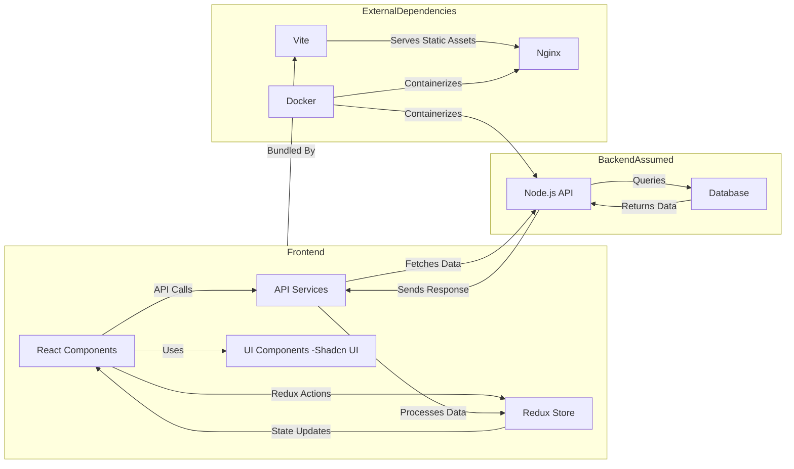
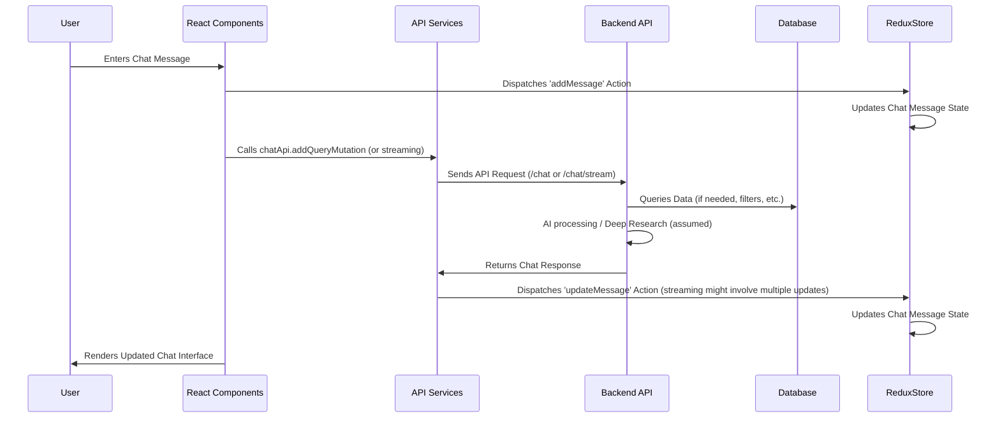

# Developer's Guide to Understanding and Contributing to Aurora

Welcome to the Aurora project! This guide is designed to onboard new developers, providing a comprehensive overview of the project, its architecture, and the development workflow. By the end of this guide, you should have a solid understanding of the codebase and be ready to contribute effectively.

## 1. PROJECT OVERVIEW

Aurora is a chat application designed to enhance research and information retrieval. It allows users to interact with an AI assistant to conduct deep research and generate responses tailored to their queries. The core functionality includes chat interfaces, filter options for refining search results, prompt template selection, and message history management.

Aurora aims to solve the problem of information overload by providing a structured and intelligent way to access and analyze data. It aims to streamline research workflows by providing an AI assistant that can understand user queries, filter relevant information, and generate comprehensive responses.

The primary user base includes researchers, analysts, and anyone seeking efficient information retrieval. Use cases involve deep research on specific topics, data analysis using customizable filters, and generating insights from large datasets.

**Tech Stack Overview:**

- **Frontend:** React, TypeScript, Redux Toolkit, Tailwind CSS, Shadcn UI, React Hook Form, Zod, Vite
- **Backend (Assumed):** Node.js (implied by Dockerfile and package.json), likely using Express.js or similar framework to serve API endpoints used by the frontend.
- **Other:** Docker, Nginx

## 2. SYSTEM ARCHITECTURE

Here's a visual representation of Aurora's core architecture:



**Explanation:**

1.  **Frontend (React Components):** The user interface, built with React, is the entry point for user interactions. It handles rendering, user input, and displaying data. Key components reside in `src/components` and `src/features`.
2.  **Redux Store:** A centralized state management system using Redux Toolkit. It manages application state, including chat messages, side panel visibility, and filter configurations. Key slices are `chatMessagesSlice.ts` and `sidePanelSlice.ts`.
3.  **API Services:** These services handle communication with the backend API. They abstract away the details of making HTTP requests and manage data fetching, caching, and error handling. Key files are `chatApi.ts`, `promptTemplateApi.ts`, and `filtersApi.ts`. RTK Query is heavily used here.
4.  **UI Components (Shadcn UI):** A collection of reusable UI components, providing a consistent and styled user experience. Configuration is handled in `components.json`.
5.  **Backend (Node.js API - Assumed):** The server-side application (details not available from provided files) is responsible for handling API requests, interacting with the database, and providing data to the frontend.
6.  **Database (Assumed):** Persists application data, such as chat messages, user information, and filter configurations.
7.  **Vite:** A build tool that bundles the frontend application for production and provides fast development with Hot Module Replacement (HMR). Configuration is in `vite.config.ts`.
8.  **Nginx:** A web server that serves the static assets of the frontend application. Configuration is in `nginx.conf`.
9.  **Docker:** A containerization platform that packages the application and its dependencies into a self-contained unit. Configuration is in `Dockerfile` and `docker-compose.yml`.

**Understanding Check:** Can you identify the components responsible for rendering the chat interface and managing the application's state?

Here's a diagram of key data flows in the system:



**Explanation:**

1. **User Input:** The user enters a chat message through the React components.
2. **Redux Update:** The `addMessage` action is dispatched to the Redux store, updating the chat message state.
3. **API Call:** The React components call the appropriate API service (e.g., `chatApi.addQueryMutation`).
4. **Backend Interaction:** The API service sends a request to the backend API (likely `/chat` or `/chat/stream`).
5. **Data Processing:** The backend API processes the request, potentially querying data from the database, performing AI processing, or conducting deep research (depending on the nature of the request).
6. **Response Handling:** The backend API returns the chat response to the API service.
7. **State Update (Streaming):** The API service dispatches the `updateMessage` action to the Redux store, updating the chat message state. For streaming responses, this might happen multiple times as chunks of data arrive.
8. **UI Update:** The React components render the updated chat interface, displaying the AI's response.

## 3. DEVELOPMENT ENVIRONMENT SETUP

**Prerequisites:**

- Node.js (v18 or higher recommended)
- pnpm (recommended package manager, install with `npm install -g pnpm`)
- Docker (if you plan to use Docker for development)
- Git

**Configuration Instructions:**

1.  **Clone the Repository:**

    ```bash
    git clone <repository_url>
    cd <repository_name>
    ```

2.  **Install Dependencies:**

    ```bash
    pnpm install
    ```

3.  **Environment Variables:**

    Create a `.env` file in the root directory. This file will contain environment-specific configurations, such as API keys and base URLs. The `docker-compose.yml` file is configured to read from this file. Refer to the `.env.example` or documentation for the required environment variables.

    Example `.env` file:

    ```
    API_URL=http://localhost:8000
    API_KEY=your_api_key
    ```

4.  **Run the Development Server:**

    ```bash
    pnpm dev
    ```

    This command starts the Vite development server, which will automatically reload the application when you make changes to the code.

5.  **Docker Setup (Optional):**

    If you want to use Docker for development, follow these steps:

    1.  Build the Docker image:

        ```bash
        docker-compose build
        ```

    2.  Run the Docker container:

        ```bash
        docker-compose up
        ```

    This command starts the application in a Docker container, accessible at `http://localhost:3000`.

**Verification Steps:**

1.  **Development Server:** Open your browser and navigate to `http://localhost:5173` (or the port specified in the Vite configuration). You should see the Aurora application running.
2.  **Docker Container:** Open your browser and navigate to `http://localhost:3000`. You should see the Aurora application running within the Docker container.
3.  **Check API Connection:** Interact with the application and ensure that it can successfully fetch data from the backend API (check the network tab in your browser's developer tools).

**Common Setup Issues and Solutions:**

- **Dependency Conflicts:** If you encounter dependency conflicts, try deleting the `node_modules` directory and running `pnpm install` again.
- **Port Conflicts:** If the development server or Docker container fails to start due to port conflicts, try changing the port in the Vite configuration or `docker-compose.yml` file.
- **Environment Variables:** Ensure that all required environment variables are defined in the `.env` file and that the application can access them.
- **Vite Cache:** Sometimes Vite's cache can cause issues. Try clearing the cache by running `pnpm vite --force`.

## 4. CODEBASE WALKTHROUGH

**Entry Points:**

- **`index.html`:** The main HTML file that loads the React application.
- **`src/main.tsx`:** The entry point for the React application. It renders the `App` component within the `<div id="root">` element.
- **`src/App.tsx`:** The root component of the application, responsible for rendering the main layout and routing.
- **`src/router/index.tsx`:** Configures the routing using React Router v6.

**Core Modules and Responsibilities:**

- **`src/components`:** Contains reusable UI components.
- **`src/features`:** Contains feature-specific components and logic, such as the chat studio, chat history, and filter configurations.
- **`src/libs/redux`:** Contains Redux store configuration and slices for managing application state.
- **`src/router`:** Contains routing configuration and protected route components.
- **`src/services`:** Contains API services for interacting with the backend.
- **`src/types`:** Contains TypeScript type definitions for data structures used throughout the application.
- **`src/utils`:** Contains utility functions for common tasks.
- **`src/validators`:** Contains Zod schemas for validating data.

**Important Design Patterns and Architectural Decisions:**

- **Redux for State Management:** Redux is used to manage the application's state in a centralized and predictable way.
- **RTK Query for Data Fetching:** RTK Query simplifies data fetching, caching, and state management.
- **Tailwind CSS for Styling:** Tailwind CSS provides a utility-first approach to styling, enabling rapid UI development.
- **Shadcn UI for UI Components:** Shadcn UI provides a collection of reusable UI components with a consistent look and feel.
- **TypeScript for Type Safety:** TypeScript provides static typing, helping to catch errors early in the development process.
- **Zod for Data Validation:** Zod is used to validate data, ensuring that it conforms to the expected format.

**Directory Structure Rationale:**

The directory structure is organized by feature and module, making it easy to locate and understand the code. Feature-specific components and logic are grouped together in the `src/features` directory, while reusable UI components are located in the `src/components` directory.

**✅ PRACTICAL EXERCISE: Trace a request through the system**

Imagine a user types "What are the latest treatments for Alzheimer's?" into the chat interface and hits send. Trace the flow of this request through the system, noting the key files and components involved. Document your findings.

1.  **User Input:** The user types the message into the `ChatInterface.tsx` component.
2.  **Redux Update:** An action is dispatched (probably `addMessage` from `chatMessagesSlice.ts`) updating the Redux store with the user's message.
3.  **API Call:** The `ChatInterface.tsx` component likely calls the `useAddQueryMutation` hook from `chatApi.ts` to send the query to the backend. If "Deep Research" is enabled, it may call `useAddSteamingQueryMutation`.
4.  **Backend Request:** The `customFetchBase.ts` is used as the base for the API call. It calls the `API_URL` endpoint (defined in `.env`) with the message.
5.  **Backend Processing (Not Visible):** The backend processes the message. This involves:
    - Authentication (checking `API_KEY`).
    - Natural Language Processing (NLP) to understand the query.
    - Data retrieval from the database.
    - Generating a response using an AI model.
6.  **API Response:** The backend sends the response back. If streaming, the response is sent back in chunks.
7.  **Redux Update:** As the response is received, the `updateMessage` action from `chatMessagesSlice.ts` (or similar) is dispatched to the Redux store, updating the message with the AI's response. For streaming, this happens iteratively.
8.  **UI Update:** `ChatInterface.tsx` displays the updated message. If a DeepResearchMessage, `DeepResearchMessage.tsx` and its subcomponents `ResearchContent.tsx` and `FinalAnswerSection.tsx` render the data.

## 5. KEY CONCEPTS TUTORIAL

Here are some fundamental concepts and patterns used in the codebase:

**1. Redux for State Management:**

Redux is a predictable state container for JavaScript apps. It helps you write applications that behave consistently across different environments (client, server, and native), are easy to test, and can be debugged with time travel.

- **Problem Solved:** Managing application state in a centralized and predictable way.
- **Code Example:**

  ```typescript
  // src/libs/redux/chatMessagesSlice.ts
  import { createSlice, PayloadAction } from "@reduxjs/toolkit";

  interface Message {
    id: string;
    sender: "user" | "assistant";
    content: string;
  }

  interface ChatState {
    messages: Message[];
  }

  const initialState: ChatState = {
    messages: [],
  };

  const chatMessagesSlice = createSlice({
    name: "chatMessages",
    initialState,
    reducers: {
      addMessage: (state, action: PayloadAction<Message>) => {
        state.messages.push(action.payload);
      },
    },
  });

  export const { addMessage } = chatMessagesSlice.actions;
  export default chatMessagesSlice.reducer;
  ```

- **🔑 KEY INSIGHT:** Redux was chosen for its predictability, maintainability, and ability to handle complex application state.
- **⚠️ COMMON PITFALL:** Overusing Redux for simple UI state can lead to unnecessary complexity. Consider using React's `useState` hook for local component state.

**2. RTK Query for Data Fetching:**

RTK Query is a powerful data fetching and caching tool from Redux Toolkit. It simplifies the process of making API requests and managing data in your application.

- **Problem Solved:** Simplifying data fetching, caching, and state management.
- **Code Example:**

  ```typescript
  // src/services/chatApi.ts
  import { createApi, fetchBaseQuery } from "@reduxjs/toolkit/query/react";

  const chatApi = createApi({
    reducerPath: "chatApi",
    baseQuery: fetchBaseQuery({ baseUrl: process.env.API_URL }),
    endpoints: (builder) => ({
      addQuery: builder.mutation({
        query: (query) => ({
          url: "/chat",
          method: "POST",
          body: { query },
        }),
      }),
    }),
  });

  export const { useAddQueryMutation } = chatApi;
  export default chatApi;
  ```

- **🔑 KEY INSIGHT:** RTK Query was chosen for its built-in caching, automatic retries, and simplified data management.
- **⚠️ COMMON PITFALL:** Forgetting to invalidate the cache after mutations can lead to stale data. Use `invalidateTags` to ensure data is up-to-date.

**3. Tailwind CSS for Styling:**

Tailwind CSS is a utility-first CSS framework that provides a set of pre-defined CSS classes for styling your application.

- **Problem Solved:** Rapid UI development and consistent styling.
- **Code Example:**

  ```tsx
  // src/components/ui/button.tsx
  import { cva, type VariantProps } from "class-variance-authority";
  import { cn } from "@/libs/utils";
  import { Loader2 } from "lucide-react";
  import { Slot } from "@radix-ui/react-slot";

  const buttonVariants = cva(
    "inline-flex items-center justify-center rounded-md text-sm font-medium transition-colors focus:outline-none focus:ring-2 focus:ring-ring focus:ring-offset-2 disabled:opacity-50 disabled:pointer-events-none data-[state=open]:bg-secondary/50",
    {
      variants: {
        variant: {
          default: "bg-primary text-primary-foreground hover:bg-primary/90",
          destructive:
            "bg-destructive text-destructive-foreground hover:bg-destructive/90",
          outline:
            "bg-transparent border border-input hover:bg-accent hover:text-accent-foreground",
          secondary:
            "bg-secondary text-secondary-foreground hover:bg-secondary/80",
          ghost: "hover:bg-accent hover:text-accent-foreground",
          link: "underline-offset-4 hover:underline text-primary",
        },
        size: {
          default: "h-10 px-4 py-2",
          sm: "h-9 rounded-md px-3",
          lg: "h-11 rounded-md px-8",
          icon: "h-10 w-10",
        },
      },
      defaultVariants: {
        variant: "default",
        size: "default",
      },
    },
  );
  ```

- **🔑 KEY INSIGHT:** Tailwind CSS was chosen for its speed, flexibility, and maintainability.
- **⚠️ COMMON PITFALL:** Overusing utility classes can lead to verbose and difficult-to-read HTML. Use component composition and custom CSS classes to avoid this.

**4. React Hook Form and Zod for Form Management and Validation:**

React Hook Form is a library for building performant, flexible, and extensible forms in React. Zod is a TypeScript-first schema declaration and validation library.

- **Problem Solved:** Simplifying form management and validation with type safety.
- **Code Example:**

  ```typescript
  // src/pages/ApiKeyPage.tsx
  import { useForm } from "react-hook-form";
  import { zodResolver } from "@hookform/resolvers/zod";
  import * as z from "zod";

  const apiKeySchema = z.object({
    apiKey: z.string().min(10, {
      message: "API Key must be at least 10 characters.",
    }),
  });

  type ApiKeyType = z.infer<typeof apiKeySchema>;

  function ApiKeyPage() {
    const form = useForm<ApiKeyType>({
      resolver: zodResolver(apiKeySchema),
      defaultValues: {
        apiKey: "",
      },
    });

    const onSubmit = (values: ApiKeyType) => {
      //Handle submit here
    };
  }
  ```

- **🔑 KEY INSIGHT:** React Hook Form and Zod were chosen for their performance, flexibility, and type safety.
- **⚠️ COMMON PITFALL:** Not handling form errors correctly can lead to a poor user experience. Use the `formState.errors` object to display error messages to the user.

**5. Aliases for Imports:**

Using aliases for imports (`@/*` for `./src/*`) improves code readability and maintainability.

- **Problem Solved:** Simplifying imports and improving code organization.
- **Code Example:**

  ```typescript
  // tsconfig.json
  {
    "compilerOptions": {
      "baseUrl": ".",
      "paths": {
        "@/*": ["./src/*"]
      }
    }
  }

  // Example usage
  import { Button } from '@/components/ui/button';
  ```

- **🔑 KEY INSIGHT:** Aliases provide a clear and consistent way to import modules, making the codebase easier to navigate and understand.
- **⚠️ COMMON PITFALL:** Forgetting to configure aliases in `tsconfig.json` or Vite configuration can lead to import errors.

## 6. WORKFLOW GUIDES

**How to Implement a New Feature:**

1.  **Create a New Branch:** Create a new branch for your feature.
2.  **Implement the Feature:** Write the code for your feature, following the coding standards and conventions.
3.  **Add Tests:** Add tests for your feature to ensure that it works correctly.
4.  **Create a Pull Request:** Create a pull request to merge your branch into the main branch.
5.  **Code Review:** Have your code reviewed by another developer.
6.  **Merge the Pull Request:** Once your code has been reviewed and approved, merge the pull request into the main branch.

**Example Flow:**

Let's say you want to add a new feature to display the current user's profile picture in the chat interface.

1.  **Create a New Branch:**

    ```bash
    git checkout -b feature/user-profile-picture
    ```

2.  **Implement the Feature:**

    - Modify the `ChatInterface.tsx` component to fetch and display the user's profile picture.
    - Create a new component for displaying the profile picture.
    - Update the API service to fetch the user's profile picture.

3.  **Add Tests:**

    - Add tests for the new component.
    - Add tests for the updated API service.

4.  **Create a Pull Request:**

    ```bash
    git add .
    git commit -m "feat: add user profile picture to chat interface"
    git push origin feature/user-profile-picture
    ```

    Create a pull request on GitHub to merge your branch into the main branch.

5.  **Code Review:**

    Have your code reviewed by another developer.

6.  **Merge the Pull Request:**

    Once your code has been reviewed and approved, merge the pull request into the main branch.

**How to Fix a Bug:**

1.  **Create a New Branch:** Create a new branch for your bug fix.
2.  **Identify the Bug:** Identify the cause of the bug and the code that needs to be modified.
3.  **Fix the Bug:** Write the code to fix the bug.
4.  **Add Tests:** Add tests to ensure that the bug is fixed and doesn't reappear in the future.
5.  **Create a Pull Request:** Create a pull request to merge your branch into the main branch.
6.  **Code Review:** Have your code reviewed by another developer.
7.  **Merge the Pull Request:** Once your code has been reviewed and approved, merge the pull request into the main branch.

**How to Add Tests for New Functionality:**

- Use Jest and React Testing Library for testing React components.
- Write unit tests for individual components and functions.
- Write integration tests to ensure that components work together correctly.
- Use mocks and stubs to isolate components during testing.
- Aim for high test coverage to ensure that all code is tested.

**Code Review Process and Standards:**

- All code changes must be reviewed by another developer before being merged into the main branch.
- Code reviews should focus on code quality, correctness, and maintainability.
- Follow the coding standards and conventions defined in the project.
- Provide constructive feedback and suggestions for improvement.
- Ensure that all tests pass before approving a pull request.

**✅ PRACTICAL EXERCISE: Implement a simple feature**

Implement a feature that displays the current date and time in the chat interface.

1.  Create a new branch: `git checkout -b feature/display-date-time`.
2.  In `ChatInterface.tsx`, add a state variable to store the current date and time.
3.  Create a function to update the date and time every second using `setInterval`.
4.  Display the date and time in the chat interface.
5.  Commit your changes and create a pull request.

## 7. COMPONENT DEEP DIVES

Let's take a closer look at some major components in the application:

**1. ChatInterface.tsx**

- **Purpose:** The main user interface component for the chat feature.
- **Responsibilities:**
  - Rendering chat messages.
  - Handling user input.
  - Sending messages to the backend.
  - Managing streaming responses.
  - Toggling side panels.
- **Key Files:** `src/features/chat-studio/chat/ChatInterface.tsx`
- **Internal Data Flow:**
  - User input is captured and stored in local state.
  - Messages are fetched from the Redux store.
  - API calls are made using the `useAddQueryMutation` hook from `chatApi.ts`.
  - Streaming responses are handled using the `useStreamingResponseForChat` hook.
  - Side panel visibility is controlled by dispatching actions to the Redux store.
- **Integration Points:**
  - Redux store for state management.
  - `chatApi.ts` for API communication.
  - `useStreamingResponseForChat` hook for streaming responses.
  - UI components from `src/components`.
- **Configuration Options:**
  - The API endpoint can be configured using the `API_URL` environment variable.
  - The side panel visibility can be controlled using Redux actions.
- **Testing Strategy:**
  - Unit tests for rendering and user interaction.
  - Integration tests to ensure that the component interacts correctly with the Redux store and API services.

**2. Redux Store (src/libs/redux)**

- **Purpose:** Centralized state management for the application.
- **Responsibilities:**
  - Storing application state.
  - Providing actions for updating the state.
  - Providing selectors for accessing the state.
- **Key Files:**
  - `src/libs/redux/store.ts`: Configures the Redux store.
  - `src/libs/redux/chatMessagesSlice.ts`: Manages the chat message state.
  - `src/libs/redux/sidePanelSlice.ts`: Manages the side panel state.
- **Internal Data Flow:**
  - Actions are dispatched from components to update the state.
  - Reducers handle the actions and update the state accordingly.
  - Selectors are used to access the state from components.
- **Integration Points:**
  - All components can access the Redux store using the `useSelector` hook.
  - Components can dispatch actions to the Redux store using the `useDispatch` hook.
- **Configuration Options:**
  - The Redux store can be configured with different reducers and middleware.
- **Testing Strategy:**
  - Unit tests for reducers to ensure that they update the state correctly.
  - Integration tests to ensure that components interact correctly with the Redux store.

**3. API Services (src/services)**

- **Purpose:** Handles communication with the backend API.
- **Responsibilities:**
  - Making API requests.
  - Caching API responses.
  - Handling API errors.
- **Key Files:**
  - `src/services/chatApi.ts`: Provides API endpoints for interacting with the chat service.
  - `src/services/promptTemplateApi.ts`: Provides API endpoints for retrieving prompt templates.
  - `src/services/filters/filtersApi.ts`: Provides API endpoints for retrieving filter options.
  - `src/services/api/apiSlice.ts`: Sets up the base API slice using RTK Query.
  - `src/services/api/customFetchBase.ts`: Defines the base query function for making API requests.
- **Internal Data Flow:**
  - Components call the API services to make requests.
  - The API services use RTK Query to handle data fetching and caching.
  - The API services return the data to the components.
- **Integration Points:**
  - Components call the API services using the `useQuery` and `useMutation` hooks from RTK Query.
  - The API services use the `apiSlice` to configure the API base URL and caching options.
- **Configuration Options:**
  - The API base URL can be configured using the `API_URL` environment variable.
  - Caching options can be configured in the `apiSlice`.
- **Testing Strategy:**
  - Unit tests for API services to ensure that they make the correct requests.
  - Integration tests to ensure that the API services interact correctly with the backend.

## 8. FIRST CONTRIBUTION GUIDE

**Contribution Workflow:**

1.  **Fork the Repository:** Fork the repository to your GitHub account.
2.  **Clone the Repository:** Clone your forked repository to your local machine.
3.  **Create a New Branch:** Create a new branch for your changes.
4.  **Make Your Changes:** Make your changes, following the coding standards and conventions.
5.  **Add Tests:** Add tests for your changes.
6.  **Commit Your Changes:** Commit your changes with a clear and concise message.
7.  **Push Your Changes:** Push your changes to your forked repository.
8.  **Create a Pull Request:** Create a pull request to merge your branch into the main repository.
9.  **Code Review:** Have your code reviewed by another developer.
10. **Merge the Pull Request:** Once your code has been reviewed and approved, merge the pull request into the main repository.

**Coding Standards and Conventions:**

- Follow the Airbnb JavaScript Style Guide.
- Use TypeScript for all new code.
- Write clear and concise code.
- Add comments to explain complex code.
- Use meaningful variable and function names.
- Keep functions short and focused.
- Avoid code duplication.
- Handle errors gracefully.
- Follow the principles of SOLID design.

**Testing Requirements:**

- All code changes must be tested.
- Write unit tests for individual components and functions.
- Write integration tests to ensure that components work together correctly.
- Aim for high test coverage.
- All tests must pass before a pull request can be merged.

**Suggested "Good First Issues":**

1.  **Problem Description:** Fix a typo in the `README.md` file.

    - **Files that Need Modification:** `README.md`
    - **Implementation Hints:** Search for typos in the file and correct them.

2.  **Problem Description:** Add a new item to the `decisionDateData` array in `src/utils/data.ts`.

    - **Files that Need Modification:** `src/utils/data.ts`
    - **Implementation Hints:** Add a new object to the array with a `label` and `value`.

3.  **Problem Description:** Add a tooltip to the "Copy" button in `AiResponseAction.tsx` to indicate when the text has been copied to the clipboard.
    - **Files that Need Modification:** `src/features/chat-studio/chat/components/AiResponseAction.tsx`
    - **Implementation Hints:** Use `useState` to track the copied state and conditionally render a tooltip using the `sonner` library.

**✅ PRACTICAL EXERCISE: Fix a simple bug**

The "TypingLoader" component currently has a typo. Fix the component's name to "TypingLoader" by renaming the file and updating the component name.

1.  Create a new branch: `git checkout -b fix/typing-loader-typo`.
2.  Rename the file from `TypingLoadder.tsx` to `TypingLoader.tsx`.
3.  Update the component name in `TypingLoader.tsx` to `TypingLoader`.
4.  Update any imports of `TypingLoadder` to `TypingLoader`.
5.  Commit your changes and create a pull request.

## 9. ADVANCED TOPICS

**Performance Considerations and Optimization Strategies:**

- **Code Splitting:** Use code splitting to reduce the initial load time of the application.
- **Lazy Loading:** Use lazy loading to load components only when they are needed.
- **Memoization:** Use memoization to avoid re-rendering components unnecessarily.
- **Virtualization:** Use virtualization to efficiently render large lists of data.
- **Image Optimization:** Optimize images to reduce their file size.
- **Caching:** Use caching to store frequently accessed data.
- **Debouncing and Throttling:** Use debouncing and throttling to limit the number of times a function is called.

**Security Patterns and Best Practices:**

- **Input Validation:** Validate all user input to prevent injection attacks.
- **Output Encoding:** Encode all output to prevent cross-site scripting (XSS) attacks.
- **Authentication and Authorization:** Implement strong authentication and authorization mechanisms.
- **Secure Communication:** Use HTTPS to encrypt communication between the client and server.
- **Regular Security Audits:** Conduct regular security audits to identify and address vulnerabilities.
- **Dependencies Scan:** Scan dependencies for security vulnerabilities.
- **Rate Limiting:** Implement rate limiting to prevent brute-force attacks.
- **CORS Configuration:** Configure CORS (Cross-Origin Resource Sharing) to restrict access to the API from unauthorized domains.

**Deployment Workflow and Environments:**

- **Development Environment:** Used for local development and testing.
- **Staging Environment:** Used for testing changes before deploying to production.
- **Production Environment:** The live environment that users interact with.

**Deployment Steps:**

1.  **Build the Application:** Build the application for production using `pnpm build`.
2.  **Containerize the Application:** Containerize the application using Docker.
3.  **Push the Image to a Registry:** Push the Docker image to a container registry (e.g., Docker Hub, AWS ECR).
4.  **Deploy the Container:** Deploy the Docker container to a server or container orchestration platform (e.g., Kubernetes, AWS ECS).
5.  **Configure the Environment:** Configure the environment variables and other settings for the deployment.
6.  **Monitor the Application:** Monitor the application for errors and performance issues.

**Monitoring and Logging:**

- Use a logging framework to log application events and errors.
- Use a monitoring tool to track application performance and health.
- Set up alerts to notify you of critical errors and performance issues.
- Use log aggregation tools to collect and analyze logs from multiple sources.
- Implement centralized logging to ease troubleshooting and maintenance.

**Scaling Considerations:**

- **Horizontal Scaling:** Add more instances of the application to handle increased traffic.
- **Vertical Scaling:** Increase the resources (CPU, memory) of the existing instances.
- **Database Scaling:** Scale the database to handle increased data volume and query load.
- **Load Balancing:** Use a load balancer to distribute traffic across multiple instances.
- **Caching:** Use caching to reduce the load on the database and backend servers.
- **CDN (Content Delivery Network):** Use a CDN to cache and deliver static assets closer to the user.

## 10. TROUBLESHOOTING AND FAQ

**Common Errors and Their Solutions:**

- **"Cannot find module" Error:** Ensure that all dependencies are installed correctly. Try deleting the `node_modules` directory and running `pnpm install` again
