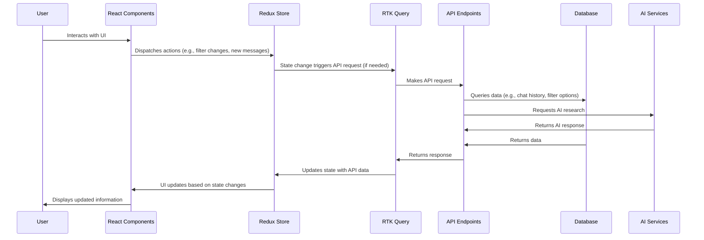

# Developer's Guide to Understanding and Contributing to Aurora

## 1. PROJECT OVERVIEW

Aurora is a React-based web application designed to enhance chat experiences through advanced filtering, deep research integration, and prompt template management. Its primary vision is to provide users with a powerful chat studio environment where they can refine conversations, leverage AI-driven research, and streamline communication using pre-defined templates.

Aurora solves the problem of information overload and inefficient communication by offering tools to filter chat messages based on various criteria (e.g., countries, agencies, diseases), seamlessly integrate deep research capabilities to provide context and insights, and enable the use of prompt templates to standardize and accelerate responses.

The primary user base for Aurora includes researchers, analysts, and communicators who need to efficiently manage and extract insights from large volumes of chat data. Use cases range from market research and competitive analysis to internal communication optimization and knowledge management.

The core tech stack includes:

*   **Frontend:** React, TypeScript, Redux Toolkit, Tailwind CSS, Shadcn UI, React Router
*   **Build Tool:** Vite
*   **State Management:** Redux Toolkit
*   **Styling:** Tailwind CSS
*   **UI Components:** Shadcn UI
*   **Routing:** React Router
*   **API Interaction:** RTK Query
*   **Validation:** Zod
*   **Linting:** ESLint
*   **Containers:** Docker, Docker Compose

## 2. SYSTEM ARCHITECTURE

### Architecture Diagram

```mermaid
graph LR
    subgraph Frontend
        A[React Components] --> B(Redux Store)
        B --> C{API Slice (RTK Query)}
        A --> D[UI Components (Shadcn UI)]
        A --> E[React Router]
        E --> A

        subgraph Chat Studio
            F[Chat Interface] --> B
            G[Filter Config Controller] --> B
            H[Chat History] --> B
        end

    end

    subgraph Backend
        I[API Endpoints] --> J(Database)
        I --> K[AI Services]
    end

    Frontend --> I
    C --> I

    style A fill:#f9f,stroke:#333,stroke-width:2px
    style B fill:#ccf,stroke:#333,stroke-width:2px
    style C fill:#ccf,stroke:#333,stroke-width:2px
    style D fill:#f9f,stroke:#333,stroke-width:2px
    style E fill:#f9f,stroke:#333,stroke-width:2px
    style F fill:#f9f,stroke:#333,stroke-width:2px
    style G fill:#f9f,stroke:#333,stroke-width:2px
    style H fill:#f9f,stroke:#333,stroke-width:2px
    style I fill:#ffc,stroke:#333,stroke-width:2px
    style J fill:#cff,stroke:#333,stroke-width:2px
    style K fill:#cff,stroke:#333,stroke-width:2px

    classDef internal fill:#f9f,stroke:#333,stroke-width:2px
    classDef external fill:#ccf,stroke:#333,stroke-width:2px

    class A,D,E,F,G,H internal;
    class B,C external;
    class I,J,K external;
```

**Explanation:**

1.  **Frontend:** The application is built with React, providing the UI components.

2.  **Redux Store:** The Redux store manages application state, including chat messages, filter settings, and UI state.

3.  **API Slice (RTK Query):** RTK Query handles API interactions, fetching data and managing caching. It's connected to the Redux store to manage the API states.

4.  **UI Components (Shadcn UI):** Shadcn UI provides pre-built, styled UI components.

5.  **React Router:** Handles navigation and routing within the application.

6.  **Chat Studio:** This subgraph contains the main features: Chat Interface, Filter Config Controller, and Chat History. Each of these connects to the Redux store to access and modify the state.

7.  **Backend:** The backend provides API endpoints that interact with a database and external AI services.

8.  **Data Flow:** The frontend interacts with the backend API via RTK Query. The API fetches data from the database or AI services and returns it to the frontend, where it's displayed using React components.

9.  **External Dependencies:** The application relies on a backend API, a database for storing data, and AI services for research.

10. **Key Interfaces:** API Endpoints are a key interface between the frontend and backend.

### Data Flow Diagram



**Explanation:**

1.  **User Interaction:** The user interacts with React components in the frontend.

2.  **State Management:** React components dispatch actions to the Redux store when the user interacts with the UI (e.g., changing filters or sending a new message).

3.  **API Requests:** Changes in the Redux store trigger API requests via RTK Query.

4.  **Backend Interaction:** RTK Query sends requests to the backend API endpoints.

5.  **Data Retrieval:** The API endpoints query the database for data (e.g., chat history or filter options) and/or request AI research from external AI services.

6.  **Response Handling:** The API endpoints return data from the database and AI services to RTK Query.

7.  **State Update:** RTK Query updates the Redux store with the received data.

8.  **UI Update:** The UI updates based on the changes in the Redux store, displaying the updated information to the user.

**Understanding Check:**

*   What is the role of RTK Query in the architecture?
*   How does the frontend communicate with the backend?
*   What data is managed by the Redux store?

## 3. DEVELOPMENT ENVIRONMENT SETUP

### Prerequisites

*   **Node.js (>=18):** [https://nodejs.org/](https://nodejs.org/)
*   **pnpm:** `npm install -g pnpm`
*   **Docker:** [https://www.docker.com/](https://www.docker.com/) (Optional, for containerized development)

### Tools Installation

1.  **Install Node.js:** Download and install the latest LTS version of Node.js from the official website.
2.  **Install pnpm:** Open your terminal or command prompt and run `npm install -g pnpm`.
3.  **Install Docker:** If you plan to use Docker for development, download and install Docker Desktop from the official website.

### Configuration Instructions

1.  **Clone the repository:**

    ```bash
    git clone <repository_url>
    cd <repository_name>
    ```

2.  **Install dependencies:**

    ```bash
    pnpm install
    ```

3.  **Environment variables:**

    *   Create a `.env` file in the root directory.
    *   Add the following environment variables:

    ```
    API_URL=http://localhost:8000 #backend URL
    ```

4.  **Run the development server:**

    ```bash
    pnpm dev
    ```

    This will start the development server at `http://localhost:5173`.

### Environment Variables and Configuration Files

*   **.env:** Contains environment-specific configuration variables like API URLs and authentication keys.

    ```
    API_URL=http://localhost:8000
    ```

*   **vite.config.ts:** Configures Vite, the build tool. It defines environment variables, aliases, and plugins.

    ```typescript
    import { defineConfig, loadEnv } from 'vite'
    import react from '@vitejs/plugin-react'
    import path from 'path'

    // https://vitejs.dev/config/
    export default defineConfig(({ mode }) => {
      const env = loadEnv(mode, process.cwd(), '')
      return {
        plugins: [react()],
        resolve: {
          alias: {
            '@': path.resolve(__dirname, './src'),
          },
        },
        define: {
          'process.env.API_URL': JSON.stringify(env.API_URL),
        },
      }
    })
    ```

*   **tailwind.config.js:** Configures Tailwind CSS, defining the theme, colors, and content files.

    ```javascript
    /** @type {import('tailwindcss').Config} */
    module.exports = {
      darkMode: ["class"],
      content: [
        './pages/**/*.{ts,tsx}',
        './components/**/*.{ts,tsx}',
        './app/**/*.{ts,tsx}',
        './src/**/*.{ts,tsx}',
      ],
      prefix: "",
      theme: {
        container: {
          center: true,
          padding: "2rem",
          screens: {
            "2xl": "1400px",
          },
        },
        extend: {
          colors: {
            border: "hsl(var(--border))",
            input: "hsl(var(--input))",
            ring: "hsl(var(--ring))",
            background: "hsl(var(--background))",
            foreground: "hsl(var(--foreground))",
            primary: {
              DEFAULT: "hsl(var(--primary))",
              foreground: "hsl(var(--primary-foreground))",
            },
            secondary: {
              DEFAULT: "hsl(var(--secondary))",
              foreground: "hsl(var(--secondary-foreground))",
            },
            destructive: {
              DEFAULT: "hsl(var(--destructive))",
              foreground: "hsl(var(--destructive-foreground))",
            },
            muted: {
              DEFAULT: "hsl(var(--muted))",
              foreground: "hsl(var(--muted-foreground))",
            },
            accent: {
              DEFAULT: "hsl(var(--accent))",
              foreground: "hsl(var(--accent-foreground))",
            },
            popover: {
              DEFAULT: "hsl(var(--popover))",
              foreground: "hsl(var(--popover-foreground))",
            },
            card: {
              DEFAULT: "hsl(var(--card))",
              foreground: "hsl(var(--card-foreground))",
            },
          },
          borderRadius: {
            lg: "var(--radius)",
            md: "calc(var(--radius) - 2px)",
            sm: "calc(var(--radius) - 4px)",
          },
          fontFamily: {
            sans: ["var(--font-sans)", ...require("tailwindcss/defaultTheme").fontFamily.sans],
            onest: ["Onest"],
          },
          keyframes: {
            "accordion-down": {
              from: { height: "0" },
              to: { height: "var(--radix-accordion-content-height)" },
            },
            "accordion-up": {
              from: { height: "var(--radix-accordion-content-height)" },
              to: { height: "0" },
            },
          },
          animation: {
            "accordion-down": "accordion-down 0.2s ease-out",
            "accordion-up": "accordion-up 0.2s ease-out",
          },
        },
      },
      plugins: [require("tailwindcss-animate")],
    }
    ```

### Verification

1.  Open your browser and navigate to `http://localhost:5173`.
2.  Verify that the application loads correctly without any errors in the console.
3.  Check if you can interact with the UI and navigate between different pages.

### Common Setup Issues and Solutions

*   **Issue:** `pnpm install` fails with dependency errors.
    *   **Solution:** Ensure you have the correct Node.js version installed. Try deleting `node_modules` and `pnpm-lock.yaml` and running `pnpm install` again.
*   **Issue:** The application loads with a blank screen or console errors.
    *   **Solution:** Check the `.env` file and `vite.config.ts` for correct configuration. Verify that the backend API is running and accessible.
*   **Issue:** Tailwind CSS classes are not applied correctly.
    *   **Solution:** Ensure that the `content` array in `tailwind.config.js` includes all relevant files. Restart the development server.

**Understanding Check:**

*   Where are environment variables defined?
*   What is the purpose of `vite.config.ts`?
*   How can you verify that the development environment is set up correctly?

## 4. CODEBASE WALKTHROUGH

### Entry Points

*   **index.html:** The main HTML file that loads the application.
*   **src/main.tsx:** The entry point for the React application, rendering the `App` component within the `<div id="root">` element in `index.html`.

### Core Modules and Responsibilities

*   **src/App.tsx:** The root component that initializes routing and renders the main layout.
*   **src/router:** Contains routing configuration and protected route logic.
*   **src/pages:** Contains page-level components (e.g., `ChatStudioPage`, `ApiKeyPage`, `NotFoundPage`).
*   **src/features/chat-studio:** Contains modules related to the chat studio feature, including chat interface, history, and filter configuration.
*   **src/libs/redux:** Manages application state using Redux Toolkit.
*   **src/services:** Defines API endpoints and data fetching logic using RTK Query.
*   **src/components:** Contains reusable UI components.

### Important Design Patterns and Architectural Decisions

*   **Redux for State Management:** Redux Toolkit is used for centralized state management, providing a predictable and scalable way to manage application state.
*   **RTK Query for API Interaction:** RTK Query simplifies data fetching and caching, reducing boilerplate code and improving performance.
*   **Tailwind CSS for Styling:** Tailwind CSS provides a utility-first approach to styling, enabling rapid UI development and consistent design.
*   **Shadcn UI for UI Components:** Shadcn UI provides pre-built, accessible UI components, improving development speed and ensuring a consistent user experience.
*   **Component-Based Architecture:** The application is built using a component-based architecture, promoting reusability and maintainability.

### Directory Structure Rationale

```
├── Dockerfile
├── components.json
├── README.md
├── package.json
├── docker-compose.yml
├── index.html
├── postcss.config.js
├── vite.config.ts
├── tailwind.config.js
├── nginx.conf
└── src
    ├── main.tsx
    ├── App.tsx
    ├── index.css
    ├── vite-env.d.ts
    ├── libs              # Libraries (Redux, Utils)
    │   └── utils.ts
    │   └── redux
    │       ├── chatMessagesSlice.ts
    │       ├── sidePanelSlice.ts
    │       ├── store.ts
    │       └── hooks.ts
    ├── pages             # Page-level components
    │   ├── ChatStudioPage.tsx
    │   ├── ApiKeyPage.tsx
    │   └── NotFoundPage.tsx
    ├── hooks             # Custom React hooks
    │   ├── useStreamingResponse.ts
    │   └── useClickOutside.tsx
    ├── types             # TypeScript type definitions
    │   ├── common.ts
    │   ├── prompt-template.ts
    │   └── deep-research.ts
    ├── router            # Routing configuration
    │   ├── routes.tsx
    │   ├── ProtectedRoute.tsx
    │   └── index.tsx
    ├── services          # API services
    │   ├── chatApi.ts
    │   ├── promptTemplateApi.ts
    │   └── filters
    │       └── filtersApi.ts
    │   └── api
    │       ├── apiSlice.ts
    │       └── customFetchBase.ts
    ├── utils             # Utility functions
    │   ├── helpers.tsx
    │   ├── data.ts
    │   ├── parser.ts
    │   └── index.ts
    ├── components        # Reusable UI components
    │   ├── hook-form
    │   │   └── HookFormItem.tsx
    │   ├── shared
    │   │   ├── TypingLoadder.tsx
    │   │   ├── TextSelectionWrapper.tsx
    │   │   └── MarkdownContent.tsx
    │   ├── spinner
    │   │   └── index.tsx
    │   └── ui            # Base UI components
    │       ├── autosize-textarea.tsx
    │       ├── accordion.tsx
    │       ├── dialog.tsx
    │       ├── card.tsx
    │       ├── form.tsx
    │       ├── popover.tsx
    │       ├── select.tsx
    │       ├── table.tsx
    │       ├── textarea.tsx
    │       ├── label.tsx
    │       ├── separator.tsx
    │       ├── button.tsx
    │       ├── scroll-area.tsx
    │       ├── calendar.tsx
    │       └── input.tsx
    ├── select
    │   ├── SimpleSelect.tsx
    │   └── MultiSelect.tsx
    ├── validators        # Validation schemas
    │   ├── authSchema.ts
    │   └── filtersSchema.ts
    └── features          # Feature-specific modules
        └── chat-studio
            ├── chat
            │   ├── ChatInterface.tsx
            │   ├── ChatMessage.tsx
            │   ├── components
            │   │   └── AiResponseAction.tsx
            │   ├── custom-message
            │   │   ├── DeepResearchMessage.tsx
            │   │   └── components
            │   │       ├── FinalAnswerSection.tsx
            │   │       └── ResearchContent.tsx
            │   └── prompt-template
            │       └── PromptTemplateModal.tsx
            ├── history
            │   └── ChatHistory.tsx
            └── filters
                ├── TableView.tsx
                └── FilterConfigController.tsx
```

*   **src:** Contains all the application's source code.
*   **components:** Reusable UI components, separated into `ui`, `shared`, and feature-specific components.
*   **features:** Feature-specific modules, encapsulating all code related to a particular feature.
*   **libs:** Utility functions and Redux store configuration.
*   **pages:** Page-level components that define the application's routes.
*   **services:** API services for interacting with the backend.
*   **types:** TypeScript type definitions.
*   **utils:** Helper functions and data.

### PRACTICAL EXERCISE: Trace a Request Through the System

**Scenario:** A user enters a query in the chat interface and sends it. Trace the request through the system.

1.  **User Input:** The user types a message in the chat input field of `src/features/chat-studio/chat/ChatInterface.tsx`.

2.  **Dispatch Action:** When the user sends the message, a Redux action is dispatched to add the message to the `chatMessages` slice in `src/libs/redux/chatMessagesSlice.ts`.

    ```typescript
    // src/libs/redux/chatMessagesSlice.ts
    import { createSlice, PayloadAction } from '@reduxjs/toolkit';
    import { ChatMessageType } from '@/types/common';

    interface ChatState {
      messages: ChatMessageType[];
      filterIds: string[];
    }

    const initialState: ChatState = {
      messages: [],
      filterIds: [],
    };

    export const chatMessagesSlice = createSlice({
      name: 'chatMessages',
      initialState,
      reducers: {
        addMessage: (state, action: PayloadAction<ChatMessageType>) => {
          state.messages.push(action.payload);
        },
        addMessages: (state, action: PayloadAction<ChatMessageType[]>) => {
          state.messages.push(...action.payload);
        },
        updateMessage: (state, action: PayloadAction<ChatMessageType>) => {
            const index = state.messages.findIndex(message => message.id === action.payload.id);
            if (index !== -1) {
              state.messages[index] = action.payload;
            }
        },
      },
    });

    export const { addMessage, addMessages, updateMessage } = chatMessagesSlice.actions;
    export default chatMessagesSlice.reducer;
    ```

3.  **API Request (useStreamingResponse):** `ChatInterface.tsx` uses the `useStreamingResponseForChat` hook in `src/hooks/useStreamingResponse.ts`. This hook triggers the `useAddSteamingQueryMutation` mutation from `src/services/chatApi.ts`. This mutation initiates a POST request to `/chat/stream` (or `/chat/deep_think/stream` if deep research is enabled).

    ```typescript
    // src/hooks/useStreamingResponse.ts
    import { useState, useEffect, useCallback } from 'react';
    import { useAppSelector } from '@/libs/redux/hooks';
    import { useAddSteamingQueryMutation } from '@/services/chatApi';
    import { ChatMessageType } from '@/types/common';

    interface UseStreamResponseForChatProps {
      messages: ChatMessageType[];
      setMessages: (messages: ChatMessageType[]) => void;
      isDeepResearchEnabled?: boolean;
    }

    export const useStreamingResponseForChat = ({ messages, setMessages, isDeepResearchEnabled }: UseStreamResponseForChatProps) => {
      const [isLoading, setIsLoading] = useState(false);
      const filterIds = useAppSelector((state) => state.sidePanel.filterIds);

      const [addStreamingQuery, { isLoading: isStreaming }] = useAddSteamingQueryMutation();

      useEffect(() => {
        setIsLoading(isStreaming);
      }, [isStreaming]);

      const handleStreamResponse = useCallback(async (query: string) => {
        setIsLoading(true);
        try {
          const endpoint = isDeepResearchEnabled ? '/chat/deep_think/stream' : '/chat/stream';
          const response = await addStreamingQuery({ query, filterIds }).unwrap();

          setMessages((prevMessages) => [...prevMessages, {
            sender: "assistant",
            content: response
          }]);

        } catch (error) {
          console.error("Error during streaming:", error);
        } finally {
          setIsLoading(false);
        }
      }, [addStreamingQuery, filterIds, isDeepResearchEnabled, setMessages]);

      return { handleStreamResponse, isLoading };
    };
    ```

4.  **API Endpoint (chatApi.ts):** The `chatApi.ts` service defines the API endpoint for sending chat queries.

    ```typescript
    // src/services/chatApi.ts
    import { apiSlice } from './api/apiSlice';

    export const chatApi = apiSlice.injectEndpoints({
        endpoints: (builder) => ({
            addQuery: builder.mutation({
                query: (query) => ({
                    url: '/chat/',
                    method: 'POST',
                    body: query,
                }),
            }),
            addSteamingQuery: builder.mutation({
                query: (body) => ({
                    url: '/chat/stream',
                    method: 'POST',
                    body,
                }),
            }),
        }),
    });

    export const { useAddQueryMutation, useAddSteamingQueryMutation } = chatApi;
    ```

5.  **Backend Processing:** The backend receives the request, processes the query, and sends a response back to the frontend. It might also interact with the database or AI services.

6.  **State Update:** The response is received by the `useStreamingResponseForChat` hook, which updates the `messages` array in the Redux store.

7.  **UI Update:** The `ChatInterface` component, which is subscribed to the `messages` state, re-renders and displays the new message.

**Understanding Check:**

*   What is the role of the Redux action in this scenario?
*   How does `useStreamingResponseForChat` hook handle API requests?
*   How is the UI updated when a new message is received?

## 5. KEY CONCEPTS TUTORIAL

### 1. Redux Toolkit for State Management

**Concept:** Redux Toolkit simplifies Redux development by providing a set of tools and conventions that reduce boilerplate code and improve developer experience.

**Code Example:**

```typescript
// src/libs/redux/chatMessagesSlice.ts
import { createSlice, PayloadAction } from '@reduxjs/toolkit';
import { ChatMessageType } from '@/types/common';

interface ChatState {
  messages: ChatMessageType[];
  filterIds: string[];
}

const initialState: ChatState = {
  messages: [],
  filterIds: [],
};

export const chatMessagesSlice = createSlice({
  name: 'chatMessages',
  initialState,
  reducers: {
    addMessage: (state, action: PayloadAction<ChatMessageType>) => {
      state.messages.push(action.payload);
    },
    addMessages: (state, action: PayloadAction<ChatMessageType[]>) => {
      state.messages.push(...action.payload);
    },
    updateMessage: (state, action: PayloadAction<ChatMessageType>) => {
        const index = state.messages.findIndex(message => message.id === action.payload.id);
        if (index !== -1) {
          state.messages[index] = action.payload;
        }
    },
  },
});

export const { addMessage, addMessages, updateMessage } = chatMessagesSlice.actions;
export default chatMessagesSlice.reducer;
```

**Explanation:**

*   `createSlice` simplifies the creation of Redux slices, automatically generating action creators and reducers.
*   `PayloadAction` provides type safety for action payloads.
*   The reducer functions directly mutate the state, thanks to Immer.js, which is integrated into Redux Toolkit.

**🔑 Key Insight:** Redux Toolkit was chosen to provide a more streamlined and efficient way to manage application state compared to traditional Redux.

**⚠️ Common Pitfall:** Forgetting to export the action creators and reducer can lead to errors. Always ensure that you export the action creators and reducer from the slice.

### 2. RTK Query for API Interaction

**Concept:** RTK Query simplifies data fetching and caching by providing a declarative approach to API interaction.

**Code Example:**

```typescript
// src/services/chatApi.ts
import { apiSlice } from './api/apiSlice';

export const chatApi = apiSlice.injectEndpoints({
    endpoints: (builder) => ({
        addQuery: builder.mutation({
            query: (query) => ({
                url: '/chat/',
                method: 'POST',
                body: query,
            }),
        }),
        addSteamingQuery: builder.mutation({
            query: (body) => ({
                url: '/chat/stream',
                method: 'POST',
                body,
            }),
        }),
    }),
});

export const { useAddQueryMutation, useAddSteamingQueryMutation } = chatApi;
```

**Explanation:**

*   `apiSlice.injectEndpoints` allows you to define API endpoints as part of a base API slice.
*   `builder.mutation` defines a mutation endpoint for sending data to the server.
*   RTK Query automatically generates React hooks for each endpoint, simplifying data fetching in components.

**🔑 Key Insight:** RTK Query was chosen to reduce boilerplate code and simplify data fetching, caching, and state management for API interactions.

**⚠️ Common Pitfall:** Not handling loading and error states correctly can lead to a poor user experience. Always check the `isLoading` and `isError` properties returned by the RTK Query hooks.

### 3. Tailwind CSS for Styling

**Concept:** Tailwind CSS is a utility-first CSS framework that provides a set of pre-defined utility classes for styling HTML elements.

**Code Example:**

```tsx
// src/components/ui/button.tsx
import * as React from "react"
import { Slot } from "@radix-ui/react-slot"
import { cva, type VariantProps } from "class-variance-authority"

import { cn } from "@/libs/utils"
import { Loader2 } from "lucide-react"

const buttonVariants = cva(
  "inline-flex items-center justify-center whitespace-nowrap rounded-md text-sm font-medium ring-offset-background transition-colors focus-visible:outline-none focus-visible:ring-2 focus-visible:ring-ring disabled:pointer-events-none disabled:opacity-50",
  {
    variants: {
      variant: {
        default: "bg-primary text-primary-foreground hover:bg-primary/90",
        destructive:
          "bg-destructive text-destructive-foreground hover:bg-destructive/90",
        outline:
          "bg-transparent border border-input hover:bg-accent hover:text-accent-foreground",
        secondary:
          "bg-secondary text-secondary-foreground hover:bg-secondary/80",
        ghost: "bg-transparent hover:bg-accent hover:text-accent-foreground",
        link: "bg-transparent underline-offset-4 hover:underline text-primary",
      },
      size: {
        default: "h-9 px-4 py-2",
        sm: "h-8 rounded-md px-3 text-xs",
        lg: "h-10 rounded-md px-8",
        icon: "h-9 w-9",
      },
    },
    defaultVariants: {
      variant: "default",
      size: "default",
    },
  }
)

export interface ButtonProps
  extends React.ButtonHTMLAttributes<HTMLButtonElement>,
    VariantProps<typeof buttonVariants> {
  asChild?: boolean
  isLoading?: boolean
}

const Button = React.forwardRef<HTMLButtonElement, ButtonProps>(
  ({ className, children, variant, size, asChild = false, isLoading = false, ...props }, ref) => {
    const Comp = asChild ? Slot : "button"
    return (
      <Comp
        className={cn(buttonVariants({ variant, size, className }))}
        ref={ref}
        {...props}
      >
        {isLoading ? <Loader2 className="mr-2 h-4 w-4 animate-spin" /> : null}
        {children}
      </Comp>
    )
  }
)
Button.displayName = "Button"

export { Button, buttonVariants }
```

**Explanation:**

*   Tailwind CSS classes are used to style the button component, such as `bg-blue-500`, `text-white`, and `rounded-md`.
*   The `cn` utility function is used to merge class names, allowing for conditional styling.

**🔑 Key Insight:** Tailwind CSS was chosen to enable rapid UI development and maintain a consistent design language throughout the application.

**⚠️ Common Pitfall:** Overusing custom CSS can negate the benefits of Tailwind CSS. Try to stick to the pre-defined utility classes as much as possible.

### 4. Zod for Validation

**Concept:** Zod is a TypeScript-first validation library that allows you to define schemas for validating data.

**Code Example:**

```typescript
// src/validators/authSchema.ts
import { z } from "zod"

export const apiKeySchema = z.string().min(10, {
  message: "API Key must be at least 10 characters.",
})

export type ApiKeyType = z.infer<typeof apiKeySchema>
```

**Explanation:**

*   `z.string()` defines a schema for validating strings.
*   `.min(10)` specifies that the string must be at least 10 characters long.
*   `ApiKeyType` is a TypeScript type inferred from the Zod schema.

**🔑 Key Insight:** Zod was chosen to provide a type-safe and efficient way to validate data, improving data integrity and preventing errors.

**⚠️ Common Pitfall:** Not handling validation errors correctly can lead to a poor user experience. Always display informative error messages to the user.

## 6. WORKFLOW GUIDES

### How to Implement a New Feature (Example Flow)

**Scenario:** Implement a feature that allows users to export chat history to a text file.

1.  **Create a new branch:**

    ```bash
    git checkout -b feature/export-chat-history
    ```

2.  **Implement the feature:**

    *   Create a new component, `src/components/ExportChatHistory.tsx`, that exports the chat history to a text file.

        ```tsx
        // src/components/ExportChatHistory.tsx
        import { Button } from "@/components/ui/button";
        import { useAppSelector } from "@/libs/redux/hooks";
        import { saveAs } from 'file-saver';

        const ExportChatHistory = () => {
          const chatMessages = useAppSelector((state) => state.chatMessages.messages);

          const handleExport = () => {
            const chatText = chatMessages.map((message) => `${message.sender}: ${message.content}`).join('\n');
            const blob = new Blob([chatText], { type: 'text/plain;charset=utf-8' });
            saveAs(blob, 'chat_history.txt');
          };

          return (
            <Button onClick={handleExport}>Export Chat History</Button>
          );
        };

        export default ExportChatHistory;
        ```

    *   Add the component to the `ChatInterface` in `src/features/chat-studio/chat/ChatInterface.tsx`.

        ```tsx
        // src/features/chat-studio/chat/ChatInterface.tsx
        import ExportChatHistory from "@/components/ExportChatHistory";

        const ChatInterface = () => {
            // ...other code
            return (
                <div>
                    {/* ...other components */}
                    <ExportChatHistory />
                </div>
            );
        };
        ```

3.  **Add tests:**

    *   Create a test file, `src/components/ExportChatHistory.test.tsx`, and add tests to verify that the component exports the chat history correctly.

4.  **Commit the changes:**

    ```bash
    git add .
    git commit -m "feat: implement export chat history feature"
    ```

5.  **Create a pull request:**

    *   Push the branch to the remote repository.
    *   Create a pull request from the `feature/export-chat-history` branch to the `main` branch.

6.  **Code review:**

    *   Wait for the code review and address any feedback.

7.  **Merge the pull request:**

    *   Once the code review is complete and all feedback has been addressed, merge the pull request into the `main` branch.

### How to Fix a Bug (Debugging Approach)

1.  **Identify the bug:**

    *   Reproduce the bug and